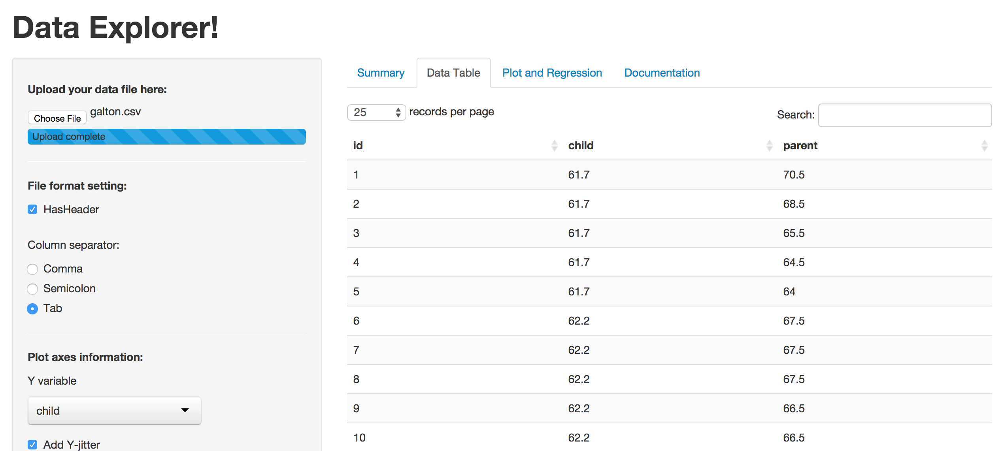
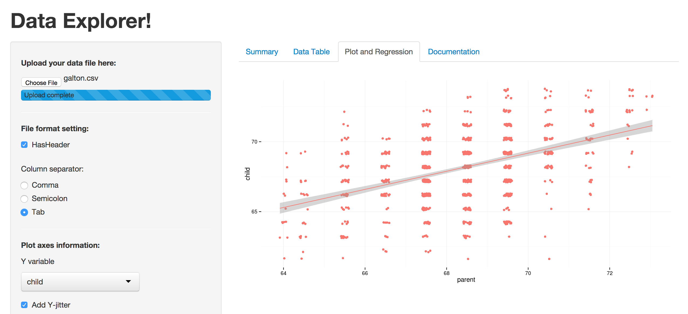
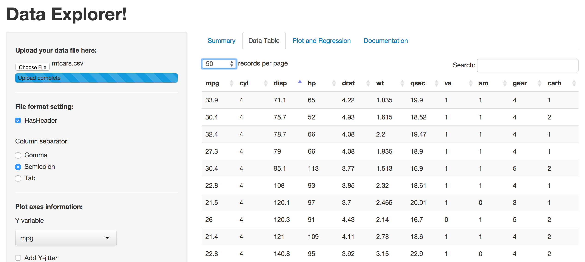
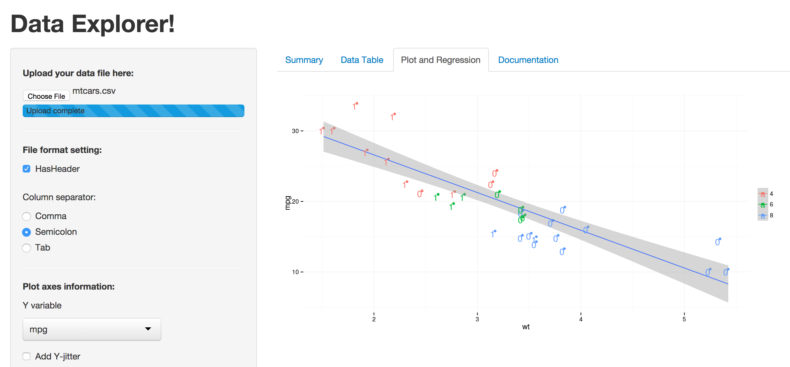

Data Explorer! - a shiny tool for data exploration
========================================================
author: plisko
date: 23 november 2014
transition: fade

Data Exploration
========================================================
*Data Exploration* is a foundamental part in any Data Analysis task.
Several activities are performed, including:

- loading the data in an easy-to-use format (such as an R data frame)
- extracting some dataset statistics (summarizing)
- drawing several plots of the data, highlighting relations between data

Performing these activities from scratch for each data set can be time-consuming and error-prone..

Data Explorer tool
========================================================
**Data Explorer!** is a web tool that allows the user to perform basic Data Exploration tasks easily and quicky, and without writing a line of R code!

The tool provides these functionalities:
- loading of csv/tsv files
- summarizing and navigating (viewing, sorting, searching) the data as a table
- plotting the data and interpolating a regression line
- data points can be labelled and colored according to your data

Available here: https://plisko.shinyapps.io/shiny_hw/

Let's consider two sample datasets..
========================================================
**galton dataset**

```r
library(UsingR)
data(galton)
head(galton,7)
```

```
  child parent
1  61.7   70.5
2  61.7   68.5
3  61.7   65.5
4  61.7   64.5
5  61.7   64.0
6  62.2   67.5
7  62.2   67.5
```
***
**mtcars dataset**

```r
library(UsingR)
data(mtcars)
head(mtcars,2)
```

```
              mpg cyl disp  hp drat    wt  qsec vs am gear carb
Mazda RX4      21   6  160 110  3.9 2.620 16.46  0  1    4    4
Mazda RX4 Wag  21   6  160 110  3.9 2.875 17.02  0  1    4    4
```

.. and let's explore them!
========================================================
**galton dataset**


***
**mtcars dataset**



