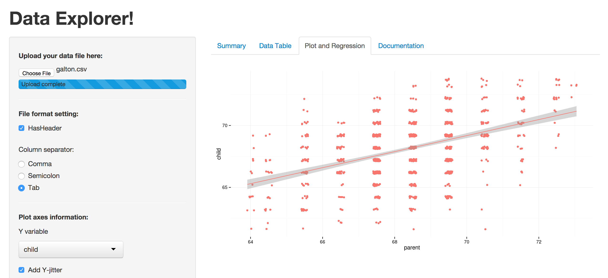
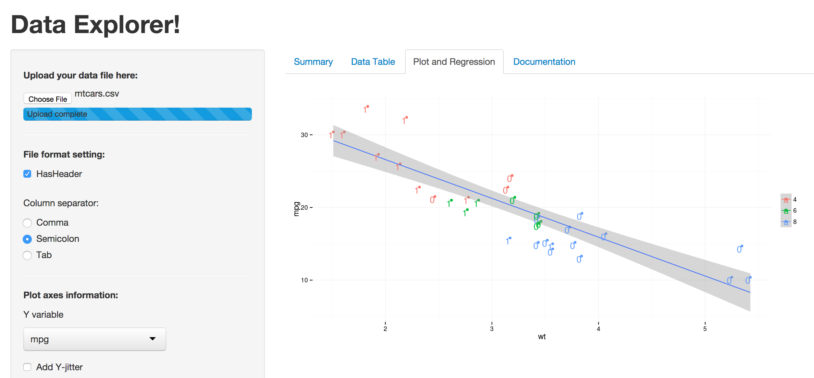

Data Explorer - a shiny tool for data exploration
========================================================
author: plisko
date: 23 november 2014

Classic Data Exploration
========================================================

For more details on authoring R presentations click the
**Help** button on the toolbar.

- Bullet 1
- Bullet 2
- Bullet 3

Data Exploration using the tool
========================================================

For more details on authoring R presentations click the
**Help** button on the toolbar.

- Bullet 1
- Bullet 2
- Bullet 

Example 1 (galton)
========================================================

Example 2 (mtcars)
========================================================

